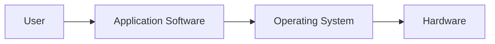
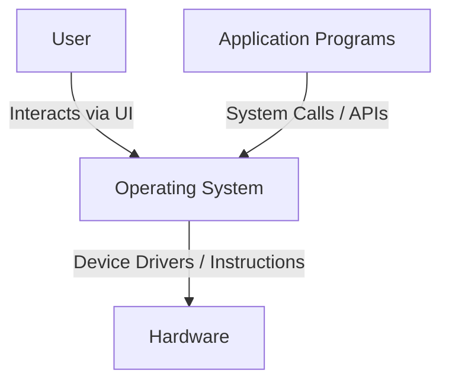
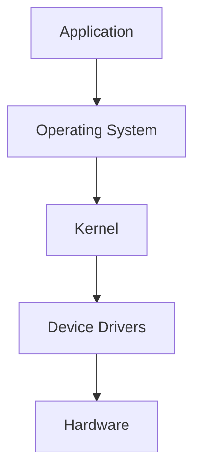
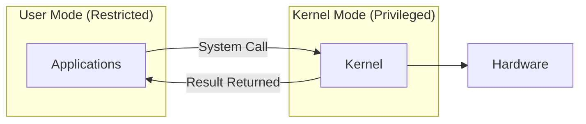
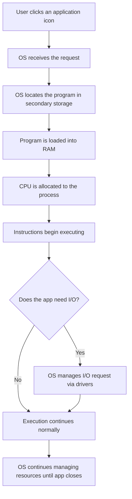
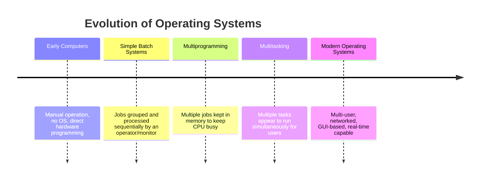

# Introduction and Need of Operating System
### Unit 1 — Operating System | BCA Study Notes

⋆˚꩜｡ *Please Give a Star*

---

## Table of Contents

1. [What is an Operating System?](#1-what-is-an-operating-system)
2. [Why Do We Need an Operating System?](#2-why-do-we-need-an-operating-system)
3. [Operating System as an Interface](#3-operating-system-as-an-interface)
4. [Operating System as a Resource Manager](#4-operating-system-as-a-resource-manager)
5. [Operating System as a Control Program](#5-operating-system-as-a-control-program)
6. [Goals / Objectives of an Operating System](#6-goals--objectives-of-an-operating-system)
7. [Major Areas Managed by an Operating System](#7-major-areas-managed-by-an-operating-system)
8. [Interaction Between Operating System and Hardware](#8-interaction-between-operating-system-and-hardware)
9. [Kernel and Operating System](#9-kernel-and-operating-system)
10. [User Mode and Kernel Mode](#10-user-mode-and-kernel-mode)
11. [Real-World Example: What Happens When a User Opens an Application?](#11-real-world-example-what-happens-when-a-user-opens-an-application)
12. [Evolution and Need for Operating Systems](#12-evolution-and-need-for-operating-systems)
13. [Exam Preparation](#13-exam-preparation)
14. [Final Concept Map](#14-final-concept-map)

---

## 1. What is an Operating System?

### Concept

An **Operating System (OS)** is the most important piece of **system software** running on a computer. It sits between the **user/application programs** and the **hardware**, making the hardware usable, manageable, and shareable.

### Simple Explanation

Think of a computer as a huge factory full of machines (CPU, memory, disk, printer, keyboard...). Without a manager, these machines would sit idle or run chaotically. The **OS is the factory manager** — it decides which machine does what, when, and for whom.

### Technical Definition

> An Operating System is **system software that manages computer hardware, software resources, and provides common services for computer programs**. It acts as an **intermediary between the user and the computer hardware**, controlling and coordinating the use of hardware among various application programs.

### OS as System Software

* Software is broadly divided into:
  * **System Software** — manages and controls hardware so application software can run (OS, device drivers, firmware).
  * **Application Software** — software the user directly uses for tasks (MS Word, Chrome, games).
* The OS is the **core** and most critical system software — almost nothing else can run without it.

### OS as an Intermediary / Interface

* Users and application programs **cannot talk to hardware directly** in a safe, efficient way.
* The OS provides a **layer of abstraction**:
  * Hides hardware complexity.
  * Provides simple, standard ways (system calls, APIs) to use hardware.



### Real-World Examples

| OS | Used On |
|---|---|
| Windows | Desktops, Laptops |
| Linux | Servers, Developer machines, Android base |
| macOS | Apple desktops/laptops |
| Android | Smartphones, tablets |
| iOS | iPhones, iPads |

⋆.˚ *Every device that "does something useful" with hardware — a smartphone, an ATM, a smart TV — has an OS or an OS-like controller running underneath.*

---

## 2. Why Do We Need an Operating System?

### What Happens Without an OS?

If there were no OS, **every application would need to directly control hardware itself** — every programmer would have to write code to manage the CPU, read/write to memory addresses, control the disk, and handle every device individually.

### Problems With Direct Hardware Interaction

* **Extremely complex programming** — every app would need hardware-specific instructions.
* **No portability** — a program written for one machine wouldn't run on another with different hardware.
* **No safety** — one faulty program could crash the entire system or corrupt another program's data.
* **No standardization** — every developer would reinvent how to talk to a keyboard, disk, or printer.

### Problems for Users

* No easy way to interact with the machine (no desktop, no file explorer, no way to launch programs).
* No way to organize or manage files.
* No protection of personal data from other programs.

### Problems for Application Programs

* Every program would need to know the **exact hardware specifications** of the machine it runs on.
* No shared services like memory allocation, file handling, or input/output — every app reinvents these.
* No way to run **multiple programs together** safely.

### Resource Management Problems

* Multiple programs competing for the **same CPU, memory, and devices** with no referee leads to:
  * Conflicts (two programs writing to the same memory location).
  * Starvation (one program hogging all resources).
  * Deadlock-like chaos with no coordination.

### Security and Protection Problems

* Without an OS enforcing boundaries:
  * Any program could read/modify any other program's memory.
  * Any program could access any file, including sensitive system files.
  * There would be no user accounts, permissions, or authentication.

### Efficiency Problems

* CPU and devices would sit **idle** or be used **inefficiently** without intelligent scheduling.
* No mechanism to **switch between tasks** smoothly (multitasking).

### Why Modern Computer Systems Require an OS

* Modern systems run **many programs simultaneously**, connect to **networks**, support **multiple users**, and use **complex hardware** — none of this is safely or efficiently possible without a managing layer.

```text
        WITHOUT OS                         WITH OS
   ┌───────────────────┐           ┌───────────────────┐
   │ App talks directly│           │ App → OS → Hardware│
   │ to raw hardware    │   VS      │  (safe, managed,   │
   │ (complex, unsafe)  │           │   standardized)    │
   └───────────────────┘           └───────────────────┘
```

---

## 3. Operating System as an Interface

### Concept

The OS acts as a **bridge** connecting three layers: the **user**, the **application programs**, and the **hardware**.



### User Interface

* The way a **human** interacts with the computer.
* Two major types:

| Type | Description | Example |
|---|---|---|
| **GUI** (Graphical User Interface) | Visual, icon and window based interaction | Windows Desktop, macOS Finder |
| **CLI** (Command Line Interface) | Text-based commands typed by the user | Linux Terminal, Windows CMD/PowerShell |

* **GUI vs CLI — Important Distinction**
  * GUI is beginner-friendly, visual, slower for expert repetitive tasks.
  * CLI is faster for experienced users, more powerful for automation/scripting, but has a steeper learning curve.

### Application Interface

* The OS provides **APIs and system calls** so application programs can request services (opening a file, allocating memory, printing) without knowing hardware details.
* Example: When a text editor "saves a file," it calls an OS function — it doesn't directly write to the disk's physical sectors.

### Hardware Interface

* The OS communicates with hardware through **device drivers** — specialized programs that know how to talk to a specific hardware component.
* This interface **hides hardware differences** from the user and application layer.

### Examples

* Clicking a **desktop icon** (GUI) → OS locates and launches the program.
* Typing `ls` or `dir` (CLI) → OS lists files in the current directory.
* A photo-editing app requesting more memory → OS allocates RAM via system calls.

---

## 4. Operating System as a Resource Manager

### Concept

A computer has limited **resources** (CPU time, memory, storage, devices). Multiple programs compete for these resources. The OS's job is to **allocate, track, and reclaim** these resources fairly and efficiently.

```text
                         Operating System
                        (Resource Manager)
                                │
        ┌───────────┬──────────┼──────────┬────────────┬─────────────┐
        │           │          │          │            │             │
      CPU        Memory    Secondary   I/O Devices    Files       Network
                            Storage                              Resources
```

### CPU

* Decides **which process gets the CPU and for how long** (scheduling).
* Ensures fair sharing among multiple running programs.

### Main Memory (RAM)

* Allocates memory space to programs when they load.
* Reclaims memory when programs finish.
* Prevents one program from overwriting another's memory.

### Secondary Storage

* Manages files and free/used space on hard disks, SSDs.
* Organizes data into files and directories.

### Input/Output Devices

* Manages keyboards, mice, printers, monitors, network cards.
* Uses **device drivers** to standardize communication.

### Files

* Provides a structured way to **create, read, write, delete, and organize** data as files and folders.

### Network Resources

* Manages network connections, data transmission, and sharing of network-based resources (especially in distributed/server systems).

⋆˚꩜｡ **Key Point:** As a Resource Manager, the OS answers: *"Who gets what resource, how much, and when?"*

---

## 5. Operating System as a Control Program

### Concept

Beyond just allocating resources, the OS **controls and supervises** the execution of programs and hardware operations to keep the system running correctly and safely.

### Program Execution

* Loads programs into memory.
* Starts, pauses, resumes, and terminates program execution.

### Hardware Control

* Directly issues commands to hardware components through drivers.
* Ensures hardware operates within safe, defined limits.

### I/O Control

* Manages data transfer between programs and devices.
* Handles interrupts (signals from hardware needing attention).

### Error Handling

* Detects and responds to errors such as:
  * Invalid memory access.
  * Device failures.
  * Program crashes.
* Prevents a single error from crashing the entire system.

### Protection

* Prevents unauthorized access to memory, files, and devices.
* Enforces user permissions and process isolation.

### Coordination Between Software and Hardware

* Ensures software instructions are correctly translated into hardware actions **without conflicts**.

### Resource Manager vs Control Program — Important Distinction

| Resource Manager | Control Program |
|---|---|
| Focuses on **allocating** resources (CPU, memory, devices) among programs | Focuses on **supervising execution** and correctness of operations |
| Answers "who gets the resource?" | Answers "is the operation being done correctly and safely?" |
| Example: deciding which process uses CPU next | Example: handling an illegal memory access error |

---

## 6. Goals / Objectives of an Operating System

### Convenience

* Makes the computer **easier and more pleasant to use** for humans.
* Example: A GUI lets users click icons instead of memorizing commands.

### Efficiency

* Ensures hardware resources (CPU, memory, devices) are used **optimally**, minimizing waste and idle time.

### Resource Utilization

* Maximizes the use of all available resources across multiple users/programs, rather than letting them sit idle.

### Reliability

* The system should perform its intended functions **correctly and consistently**, without unexpected failures.

### Security

* Protects the system and data from **unauthorized external access**, malware, and misuse.

### Protection

* Ensures programs and users **cannot interfere** with each other's data, memory, or resources (internal safeguarding, distinct from external security).

### Ability to Evolve

* A well-designed OS can be **updated, extended, and modified** over time — new features, hardware support, and security patches can be added without redesigning the whole system.

```text
                    Goals of an Operating System
                              │
   ┌───────────┬─────────────┼─────────────┬────────────┬────────────┐
   │           │              │             │            │            │
Convenience  Efficiency  Resource      Reliability   Security/    Ability to
                          Utilization                Protection    Evolve
```

⋆.˚ **Security vs Protection — Important Distinction**
* **Security** deals with threats from **outside** the system (hackers, malware, unauthorized users).
* **Protection** deals with controlling access **within** the system (one process accessing another's memory, file permissions).

---

## 7. Major Areas Managed by an Operating System

*(This section introduces each area only briefly — each has its own dedicated future topic.)*

```text
                              Operating System
                                     │
      ┌───────────┬───────────┬─────┼─────┬────────────┬────────────┬──────────────┐
      │           │           │     │     │            │            │              │
   Process     Memory       File   I/O  Secondary   Protection  Networking      User
 Management  Management  Management Mgmt  Storage    & Security                Interface
                                            Mgmt
```

* **Process Management** — creating, scheduling, and terminating processes (running programs).
* **Memory Management** — allocating and freeing main memory for processes.
* **File Management** — organizing, storing, retrieving, and naming files.
* **I/O and Device Management** — controlling input/output devices via drivers.
* **Secondary-Storage Management** — managing disk space, free space, and storage allocation.
* **Protection and Security** — safeguarding data and resources from unauthorized access.
* **Networking** — enabling communication between computers over a network.
* **User Interface** — providing GUI/CLI for user interaction.

---

## 8. Interaction Between Operating System and Hardware

### Layers Involved



* **Application** — the program the user runs (e.g., a browser).
* **Operating System** — provides services and manages resources for the application.
* **Kernel** — the core of the OS that directly interacts with hardware.
* **Device Drivers** — translate generic OS commands into hardware-specific instructions.
* **Hardware** — the actual physical components (CPU, disk, printer, etc.).

### How They Interact

1. The application requests a service (e.g., "print this document") using a **system call**.
2. The OS/kernel receives this request.
3. The kernel passes the request to the appropriate **device driver**.
4. The driver converts it into **hardware-specific commands**.
5. The hardware performs the action and may send back data or a signal (**interrupt**).

### Practical Examples

* **Printing a document:** App → OS → Printer driver → Printer hardware → paper printed.
* **Saving a file:** App → OS file system calls → Disk driver → Data written to disk sectors.
* **Typing on a keyboard:** Keyboard hardware → keyboard driver → kernel → OS → application receives keystroke.

---

## 9. Kernel and Operating System

### What is a Kernel?

> The **kernel** is the **core component** of the Operating System — the part that has **direct and privileged control** over the hardware. It manages the most critical tasks: CPU scheduling, memory management, and device control.

### Kernel vs Operating System — Important Distinction

| Kernel | Operating System |
|---|---|
| The **core**, lowest-level part that directly manages hardware | The **complete package** — includes kernel + utilities + user interface + system programs |
| Runs in **privileged mode** with direct hardware access | Includes both privileged (kernel) and non-privileged (user-facing) components |
| Example: Linux kernel | Example: Ubuntu (uses Linux kernel + GUI + apps + utilities) |

⋆˚꩜｡ **Simple way to remember:** *The kernel is the "engine," the OS is the "entire car" — body, seats, dashboard, and engine together.*

### Why the Kernel is Important

* It is the **first program loaded** after the bootloader and stays in memory the entire time the computer runs.
* All hardware access **must** pass through the kernel — this is essential for security, stability, and coordination.

### Responsibilities of the Kernel

* CPU and process scheduling.
* Memory allocation and protection.
* Managing device drivers and I/O.
* Handling system calls from applications.
* Enforcing security and access control.

### User Space vs Kernel Space

```text
   ┌─────────────────────────────┐
   │        User Space           │  ← Applications, user programs
   │  (limited, unprivileged)     │
   ├─────────────────────────────┤
   │        Kernel Space         │  ← Kernel, drivers
   │  (privileged, direct access) │
   ├─────────────────────────────┤
   │          Hardware           │
   └─────────────────────────────┘
```

* **User Space** — where normal applications run, with restricted access to hardware and memory.
* **Kernel Space** — a protected area of memory where the kernel and its critical operations execute with full privileges.

### Privileged Operations

* Operations only the kernel is allowed to perform directly, such as:
  * Directly accessing hardware registers.
  * Managing memory tables.
  * Controlling interrupts.
* Applications must go through **system calls** to request the kernel perform these on their behalf.

---

## 10. User Mode and Kernel Mode

### What is User Mode?

* A restricted CPU execution mode in which **application programs run**.
* Programs in user mode **cannot directly access hardware** or execute privileged instructions.

### What is Kernel Mode?

* A privileged CPU execution mode in which the **kernel runs**.
* Has **full, unrestricted access** to hardware and memory.

### Why Are Two Modes Required?

* To **protect the system** from buggy or malicious programs.
* If every program could run in kernel mode, a single crashing or malicious application could:
  * Corrupt memory belonging to other programs.
  * Directly damage or misuse hardware.
  * Crash the entire operating system.



### Privileged Instructions

* Instructions that can **only** be executed in kernel mode, such as:
  * Modifying memory management settings.
  * Directly controlling I/O devices.
  * Halting the CPU.
* If a user-mode program attempts a privileged instruction directly, the hardware **traps** the attempt and the OS handles it (usually terminating the offending program or raising an error).

### Protection

* The **mode bit** (a hardware flag) tells the CPU whether it is currently in user mode or kernel mode.
* Switching from user mode to kernel mode happens in a controlled way — via a **system call** or **interrupt** — never by the application directly jumping into privileged execution.

### Simple Practical Example

* A word processor (user mode) wants to save a file.
* It **cannot** directly write to the disk (that would be a privileged operation).
* Instead, it makes a **system call** → CPU switches to **kernel mode** → OS performs the disk write safely → control returns to **user mode**.

### User Mode vs Kernel Mode — Quick Comparison

| Aspect | User Mode | Kernel Mode |
|---|---|---|
| Access Level | Restricted | Full/privileged |
| Who Runs Here | Application programs | OS kernel |
| Direct Hardware Access | ✗ Not allowed | ✓ Allowed |
| Risk if Compromised | Limited to the program | Can affect entire system |

---

## 11. Real-World Example: What Happens When a User Opens an Application?

### Step-by-Step Explanation



1. **User clicks an application icon**
   * This is a GUI action interpreted by the OS's user interface component.

2. **OS receives the request**
   * The OS identifies which program the user wants to run and prepares to launch it.

3. **Program is located in storage**
   * The OS's file management system finds the executable file on the secondary storage (SSD/HDD).

4. **Program is loaded into RAM**
   * The OS's memory management component copies the necessary parts of the program from storage into main memory, since the CPU can only execute instructions from RAM (not directly from disk).

5. **CPU is assigned**
   * The OS's process management/scheduler assigns CPU time to this newly created process, alongside any other running processes.

6. **Instructions execute**
   * The CPU begins fetching and executing the program's instructions, in the sequence dictated by the program logic.

7. **Application performs I/O if needed**
   * If the application needs to read a file, accept keyboard input, or display something on screen, it issues **system calls** — the OS/kernel handles these through the appropriate device drivers.

8. **OS manages the resources**
   * Throughout the application's life, the OS continues to manage its memory, CPU time, and I/O — and eventually reclaims all resources when the application closes.

⋆.˚ *This single example demonstrates the OS acting simultaneously as an interface, resource manager, and control program — all three roles working together.*

---

## 12. Evolution and Need for Operating Systems

### Concept

Operating systems evolved gradually as computers became more powerful and user demands grew. Each stage solved limitations of the previous one — this evolution directly explains **why** we need the OS types studied in the next topic (Classification).



### Early Computers / Manual Operation

* No OS existed. Operators manually loaded programs and manually controlled hardware using switches/punch cards.
* Extremely slow, error-prone, and required deep technical expertise from every user.

### Simple Batch Systems

* Jobs (programs) with similar needs were **grouped into batches** and processed one after another automatically by a "monitor" program — an early, simple ancestor of the OS.
* Reduced manual intervention but still processed only **one job at a time**.

### Multiprogramming

* Multiple jobs are kept in **main memory simultaneously**.
* When one job waits for I/O, the CPU switches to another job instead of sitting idle — greatly improving CPU utilization.

### Multitasking

* An extension of multiprogramming focused on **user responsiveness** — the system rapidly switches between tasks so that multiple programs appear to run **at the same time** from the user's perspective.

### Modern Operating Systems

* Support multiple users, networking, graphical interfaces, security, real-time responsiveness, and run across devices from smartphones to servers.

⋆˚꩜｡ *This evolution — batch → multiprogramming → multitasking → modern OS — is the foundation for the upcoming **Operating System Classification** topic, where each of these stages becomes a formal category.*

---

## 13. Exam Preparation

### Important Definitions

* Operating System
* Kernel
* User Mode / Kernel Mode
* System Call
* Device Driver
* Resource Manager
* Control Program

### Important Concepts

* Why an OS is necessary (not just "what" it does, but the **problems it solves**).
* The role of the OS as interface, resource manager, and control program — and how these three roles differ.
* The relationship between kernel space and user space.
* Why two CPU modes (user/kernel) are necessary for protection.
* The complete flow of what happens when an application is opened.
* How the evolution of OS design (batch → multiprogramming → multitasking) connects to modern OS needs.

### Common Confusions

* **OS vs Kernel** — the kernel is a core part of the OS, not the entire OS.
* **Security vs Protection** — security guards against external threats; protection controls access among internal processes/users.
* **Resource Manager vs Control Program** — resource manager allocates resources; control program supervises correct execution.
* **GUI vs CLI** — both are user interfaces, but differ in interaction style, speed, and learning curve.
* **User Mode vs Kernel Mode** — not the same as "user space application" vs "system application"; it refers to the **CPU's privilege level** during execution, not who wrote the program.

### Exam-Oriented Questions

**Very Short Questions**
* Define Operating System.
* What is a kernel?
* Name two examples of privileged instructions.
* What is the mode bit used for?

**Short-Answer Questions**
* Differentiate between User Mode and Kernel Mode.
* Explain the OS as a resource manager with one example each for CPU and memory.
* Distinguish between security and protection.
* What is the difference between GUI and CLI?

**Long-Answer Questions**
* Explain, with a diagram, what happens step-by-step when a user opens an application.
* Discuss the goals/objectives of an Operating System in detail.
* Explain the evolution of Operating Systems from manual operation to modern systems.
* Describe the interaction between application, OS, kernel, device drivers, and hardware with a suitable diagram.

**Conceptual Questions**
* Why can't application programs be allowed to directly access hardware?
* Why does an OS need two separate CPU modes instead of just one?
* How does the OS act as both an interface and a control program at the same time — are these roles ever in conflict?

---

## 14. Final Concept Map

```mermaid
flowchart TD
    OS[Operating System]

    OS --> Need[Need for OS]
    Need --> N1[Solves direct hardware interaction problems]
    Need --> N2[Resource conflicts]
    Need --> N3[Security & efficiency issues]

    OS --> Interface[OS as Interface]
    Interface --> I1[User Interface: GUI/CLI]
    Interface --> I2[Application Interface: APIs/System Calls]
    Interface --> I3[Hardware Interface: Device Drivers]

    OS --> ResMgr[OS as Resource Manager]
    ResMgr --> R1[CPU]
    ResMgr --> R2[Memory]
    ResMgr --> R3[Storage]
    ResMgr --> R4[I/O Devices]
    ResMgr --> R5[Files]
    ResMgr --> R6[Network]

    OS --> Control[OS as Control Program]
    Control --> C1[Program Execution]
    Control --> C2[Error Handling]
    Control --> C3[Protection]

    OS --> Goals[Goals of OS]
    Goals --> G1[Convenience]
    Goals --> G2[Efficiency]
    Goals --> G3[Reliability]
    Goals --> G4[Security & Protection]
    Goals --> G5[Ability to Evolve]

    OS --> Kernel[Kernel]
    Kernel --> K1[Kernel Space vs User Space]
    Kernel --> K2[Privileged Operations]

    OS --> Modes[User Mode / Kernel Mode]
    Modes --> M1[Protection via Mode Bit]
    Modes --> M2[System Calls switch modes]

    OS --> HWInt[Hardware Interaction]
    HWInt --> H1[App to Kernel to Driver to Hardware]

    OS --> AppExec[Application Execution Example]
    AppExec --> A1[Load to RAM to CPU to Execute to I/O]

    OS --> Evolution[Evolution of OS]
    Evolution --> E1[Batch to Multiprogramming to Multitasking to Modern OS]
```



𖹭 *This concept map ties together every idea in this topic — use it as your final revision anchor before moving to Operating System Classification.*

---

<div align="center">

⋆˚꩜｡

<div align="center">

⋆˚꩜｡

</div>

<div align="center">


</div>

If you enjoyed these notes, you'll probably enjoy the rest too.

| Platform | Link |
|---|---|
| Instagram | @mehrunnisa.ai |
| SubStack | The Epoch |
| YouTube | @mehrunnisa.ai |


**Usage Terms**
These notes are free to use for personal learning, revision, and study. Please do not:
- Sell or redistribute for profit.
- Claim them as your own work.
- Modify and republish without permission.
- Use for any unethical or unauthorized purpose.

Thank you for respecting the effort behind these notes. Happy learning. ♡

</div>
