# Functions of Operating System

⋆˚꩜｡ *Please give a STAR*

---

## Table of Contents

1. [Process Management](#1-process-management)
2. [Memory Management](#2-memory-management)
3. [File Management](#3-file-management)
4. [Device / I/O Management](#4-device--io-management)
5. [Secondary Storage Management](#5-secondary-storage-management)
6. [Protection and Security](#6-protection-and-security)
7. [CPU / Resource Management](#7-cpu--resource-management)
8. [Networking / Communication Management](#8-networking--communication-management)
9. [User Interface Management](#9-user-interface-management)
10. [Error Detection and Handling](#10-error-detection-and-handling)
11. [Accounting and Resource Monitoring](#11-accounting-and-resource-monitoring)
12. [Program Execution](#12-program-execution)
13. [Exam Preparation](#13-exam-preparation)
14. [Final Concept Map](#14-final-concept-map)

---

## 1. Process Management

### What is a Process?

> A **process** is a **program in execution**. It is an active entity that includes the program code, current activity (represented by the program counter), and the contents of the processor's registers, along with its own memory (stack, heap, data, and code sections).

### Program vs Process — Important Distinction

| Program | Process |
|---|---|
| A **passive** entity — a set of instructions stored on disk (e.g., an `.exe` file) | An **active** entity — a program that is currently executing |
| Has no state of its own until run | Has a state (new, ready, running, waiting, terminated) |
| Exists permanently on storage | Exists temporarily, only while executing |
| One program can create **many processes** (e.g., opening the same app twice) | Each process is a separate, independent execution instance |


### Process Creation

* A new process is created when:
  * A user launches an application.
  * An existing process spawns another (**parent-child relationship**).
  * The system starts a background service.
* The OS allocates a unique **Process ID (PID)**, memory space, and initializes a **Process Control Block (PCB)** to track the process.

### Process Termination

* A process ends when:
  * It completes execution normally.
  * It is terminated by the user or OS.
  * It encounters a fatal error.
* On termination, the OS **reclaims all resources** (memory, open files, CPU allocation) held by the process.

### Process States

* **New** — process is being created.
* **Ready** — process is waiting to be assigned to the CPU.
* **Running** — instructions are currently being executed by the CPU.
* **Waiting (Blocked)** — process is waiting for an event (like I/O completion).
* **Terminated** — process has finished execution.

### Process State Transition Diagram

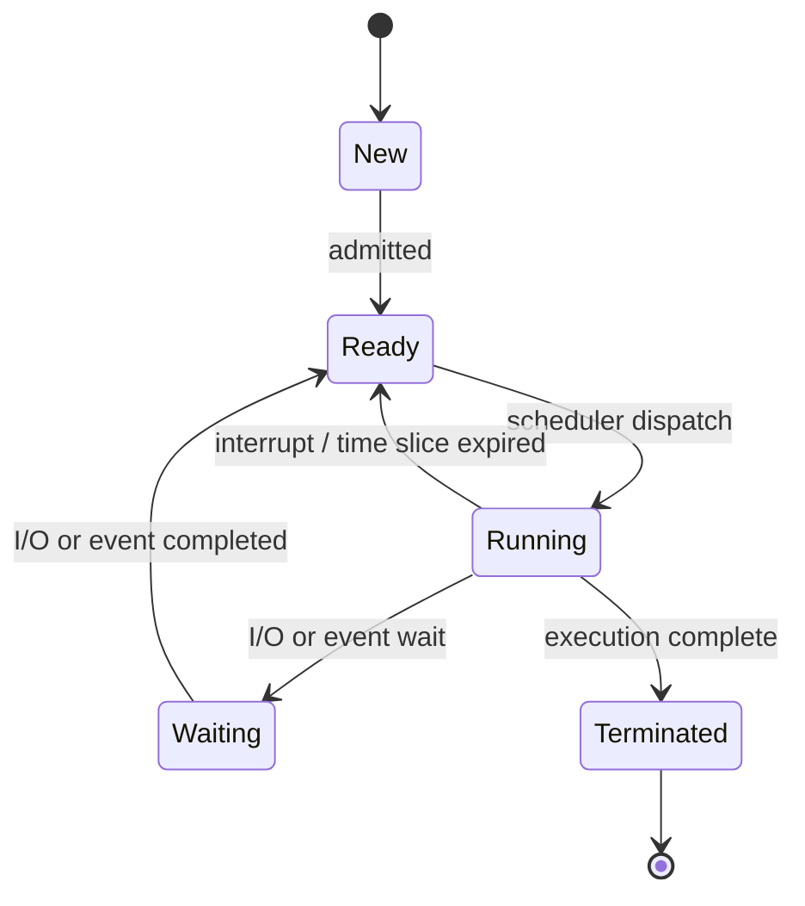

### Process Scheduling

* Since multiple processes compete for the CPU, the OS uses a **scheduler** to decide which process runs next.
* The goal is to maximize **CPU utilization** and ensure **fair, efficient** execution among all processes.
* *(Detailed scheduling algorithms belong to a dedicated future topic — here it's introduced only conceptually.)*

### CPU Allocation

* The OS's **dispatcher** hands over control of the CPU to the selected process from the ready queue.
* Only **one process** can actually run on a single CPU core at any given instant — the illusion of "many programs running together" comes from very fast switching.

### Context Switching

* When the CPU switches from one process to another, the OS must:
  1. Save the current process's state (registers, program counter) into its PCB.
  2. Load the next process's saved state from its PCB.
  3. Resume execution of the new process.

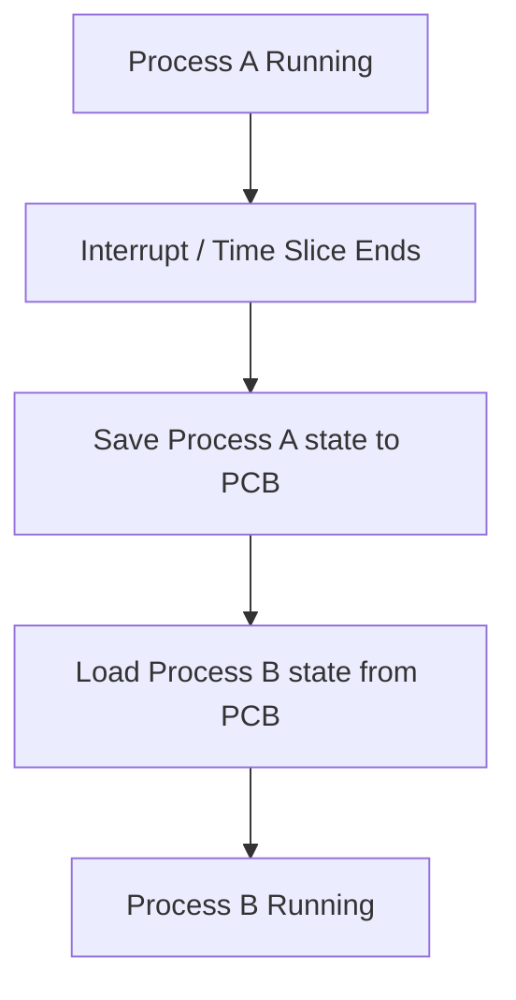

* ⋆.˚ **Key Point:** Context switching has **overhead** — time spent switching is time not spent executing useful instructions.

### Process Synchronization

* When multiple processes access **shared data or resources**, uncoordinated access can cause inconsistent results.
* The OS provides synchronization mechanisms (e.g., locks, semaphores — studied in detail later) to ensure processes access shared resources **safely and in an orderly manner**.

### Inter-Process Communication (IPC)

* Processes often need to **exchange data or signals** with each other. Common mechanisms include:
  * **Shared Memory** — processes read/write to a common memory area.
  * **Message Passing** — processes send and receive messages via the OS.


### Deadlock — Introduction

* A **deadlock** occurs when two or more processes are **each waiting for a resource held by another**, so none of them can proceed.
* Example: Process A holds Resource 1 and waits for Resource 2; Process B holds Resource 2 and waits for Resource 1 — both wait forever.
* *(Deadlock detection, prevention, and avoidance are covered in depth in a later topic.)*

### Why Process Management is Needed

* Enables **multiple programs to run concurrently** without interfering with each other.
* Ensures **fair and efficient CPU usage**.
* Maintains **isolation** so one process's failure doesn't crash others.
* Provides mechanisms for processes to **cooperate and communicate** safely.

---

## 2. Memory Management

### What is Memory Management?

> **Memory management** is the OS function responsible for **controlling and coordinating the computer's main memory (RAM)** — keeping track of which parts are in use, by whom, and allocating/deallocating memory as processes are created and terminated.

### Why Memory Management is Needed

* RAM is a **limited, shared resource** — multiple processes need memory simultaneously.
* Without management: processes could overwrite each other's memory, memory could be wasted, and the system could run out of usable memory even when space exists (fragmentation).

### Main Memory and Secondary Memory

| Main Memory (RAM) | Secondary Memory (Disk/SSD) |
|---|---|
| Volatile (data lost on power-off) | Non-volatile (data persists) |
| Fast access, used for active execution | Slower access, used for long-term storage |
| Limited capacity | Much larger capacity |
| CPU can execute instructions **only** from here | CPU **cannot** directly execute from here |

### Allocation and Deallocation of Memory

* When a process is created, the OS **allocates** memory space for its code, data, and stack.
* When a process terminates, the OS **deallocates (frees)** that memory so it can be reused by other processes.

### Tracking Memory Usage

* The OS maintains records (e.g., memory maps/tables) of:
  * Which memory regions are **allocated** and to which process.
  * Which memory regions are **free**.

### Logical vs Physical Address — Important Distinction

| Logical Address | Physical Address |
|---|---|
| Generated by the CPU during program execution (also called a **virtual address**) | The actual address in main memory (RAM) hardware |
| Used by the program itself | Used by the memory hardware |
| Translated into a physical address before actual access | The final, real location of data |

### Address Translation

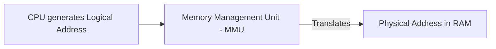

* The **MMU (Memory Management Unit)** — a hardware component — translates logical addresses into physical addresses at runtime.
* This translation allows the OS to **relocate** processes in memory freely and provides a layer of **protection and abstraction**.

### Memory Protection

* Ensures one process **cannot access or modify** the memory allocated to another process (or to the OS itself).
* Typically enforced using hardware support (base and limit registers, or paging tables) checked by the MMU.

### Swapping

* A technique where a process (or part of it) is **temporarily moved out of main memory to secondary storage** (swap space) to free up RAM for other processes, and brought back in when needed again.


### Virtual Memory — Introduction

> **Virtual memory** is a technique that gives processes the **illusion of having more memory than physically available**, by using secondary storage to extend the apparent size of RAM.

* Allows programs larger than physical RAM to run.
* Allows more processes to be active simultaneously than would otherwise fit in RAM.

### Paging — Introduction

* Divides memory into **fixed-size blocks**:
  * **Pages** — fixed-size blocks of a process's logical memory.
  * **Frames** — fixed-size blocks of physical memory.
* A process's pages are loaded into available frames, **not necessarily contiguously**, solving the problem of fragmentation.
* *(Detailed paging algorithms are covered in a dedicated future topic.)*

### Segmentation — Introduction

* Divides a process's memory into **logical segments** based on function (e.g., code segment, data segment, stack segment), each of **variable size**.
* Segmentation reflects how programmers naturally think about a program's structure, unlike paging's fixed-size blocks.

```text
              Memory Management Concepts
                        │
        ┌───────────────┼───────────────┐
        │               │               │
     Swapping    Virtual Memory     Paging /
                                   Segmentation
```

---

## 3. File Management

### What is a File?

> A **file** is a named collection of related data or information stored on secondary storage, treated as a single logical unit by the OS.

### Why File Management is Needed

* Provides a **structured, consistent** way to store, organize, retrieve, and protect data.
* Without it, data would be scattered as raw bits with no organization, naming, or access control.

### File Creation

* The OS allocates space on secondary storage and creates an entry (with metadata) in the file system for a new file.

### File Deletion

* The OS removes the file's entry and **frees the storage space** it occupied for reuse.

### File Reading/Writing

* **Read** — retrieving data from a file into memory for use by a program.
* **Write** — sending data from a program to be stored in a file.
* The OS manages these operations, ensuring correct positioning (via file pointers) and consistency.

### File Organization

* Refers to how data is **physically arranged within a file** for efficient storage and access, such as sequential organization (data stored in order).

### File Naming

* Every file has a unique name (within its directory) plus typically an **extension** indicating its type (`.docx`, `.mp3`, `.exe`).

### File Attributes

* Metadata associated with a file, such as:
  * Name, size, type, location.
  * Creation date, last modified date.
  * Owner and permissions.

### Directories

* A **directory** is a container that organizes files (and other directories) into a hierarchical structure, making files easier to locate and manage.

### Directory Management

* The OS supports operations like creating, deleting, renaming, and navigating directories, and maintains the relationships between directories and the files/subdirectories within them.

### File Permissions

* Define **who can do what** with a file — e.g., read, write, execute — for the owner, group, and other users.

### File Protection

* Mechanisms to prevent **unauthorized access, modification, or deletion** of files, closely tied to permissions and user accounts.

### File-System Organization

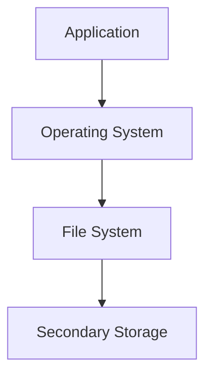

### File Hierarchy / Directory Tree Example

```text
                     Root ( / or C:\ )
                          │
          ┌───────────────┼───────────────┐
          │               │               │
        Users          Programs         System
          │
     ┌────┴────┐
     │         │
  Mehrunnisa  Guest
     │
  ┌──┴──┐
Docs   Pictures
```

### File Access Flow

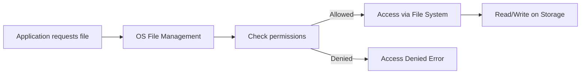

---

## 4. Device / I/O Management

### What is I/O?

> **I/O (Input/Output)** refers to the communication between the computer system and the outside world — receiving data (input) and sending out data or results (output).

### Input Devices

* Examples: Keyboard, mouse, scanner, microphone.
* Send data **into** the system for processing.

### Output Devices

* Examples: Monitor, printer, speakers.
* Receive processed data **from** the system to present to the user.

### I/O Device Management

* The OS manages a **huge variety** of devices with different speeds, data formats, and operating characteristics, and presents a **uniform interface** to applications regardless of the underlying device.

### Device Drivers

* Specialized software that allows the OS/kernel to **communicate with a specific hardware device**.
* Each device type generally needs its own driver, translating generic OS commands into device-specific instructions.

### Device Allocation

* The OS decides **which process gets access to which device and when**, especially important for devices that can only serve one process at a time (e.g., a printer).

### Device Communication


### Buffering

* Temporary storage area (**buffer**) used to **hold data** while it's being transferred between two devices, or between a device and an application, to handle speed mismatches.

### Caching

* Keeps a **copy of frequently used data** in a faster storage area (e.g., RAM) to speed up future access, reducing the need to repeatedly access slower storage.

### Buffering vs Caching — Quick Distinction

| Buffering | Caching |
|---|---|
| Handles **speed mismatch** between devices | Holds **frequently used data** for faster future access |
| Data typically used once, then discarded | Data reused multiple times |

### Spooling

> **Spooling (Simultaneous Peripheral Operations On-Line)** is a technique where data destined for a slow device (like a printer) is temporarily stored on disk in a queue, allowing multiple processes to "send" print jobs without waiting for the device to be free.

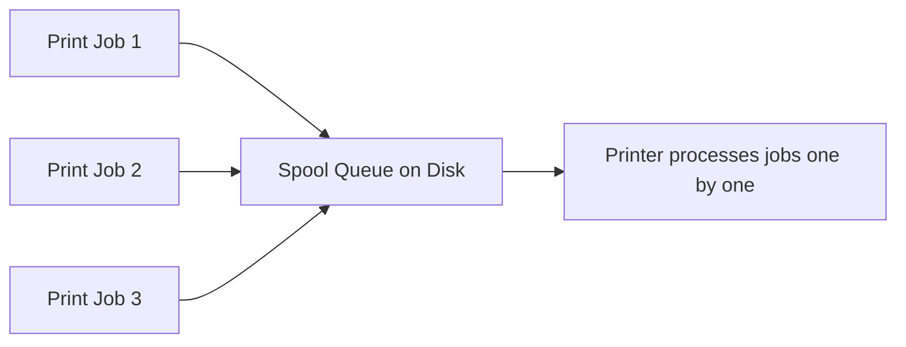

### Interrupt-Driven I/O

* Instead of the CPU **constantly checking** if a device is ready (wasteful), the device sends an **interrupt signal** to the CPU when it needs attention or has completed an operation.
* The CPU then pauses its current task, handles the interrupt (via an **interrupt handler**), and resumes.

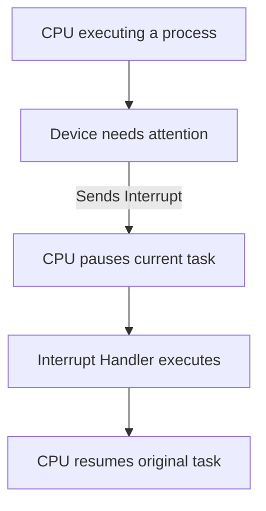

### Why the OS Controls I/O Devices

* Devices vary widely in speed and behavior — uncoordinated direct access by applications would cause **conflicts, inefficiency, and instability**.
* Centralized control allows **fair sharing**, **standardized access** (via drivers), and **protection** of devices from misuse.

---

## 5. Secondary Storage Management

### Why Secondary Storage Management is Needed

* Secondary storage (HDD/SSD) holds **persistent data** — programs and files that must survive after power-off.
* The OS must efficiently allocate, track, and protect this space since it is finite and shared among all users/programs.

### HDD (Hard Disk Drive)

* Uses spinning magnetic platters and a moving read/write head.
* Slower than SSD due to mechanical movement (seek time, rotational delay).

### SSD (Solid State Drive)

* Uses flash memory chips with no moving parts.
* Much faster access speeds compared to HDDs.

### Storage Allocation

* The OS decides **how and where** a file's data is physically placed on the storage device.

### Free-Space Management

* The OS keeps track of **which storage blocks are free** and available for new data, using structures such as free lists or bitmaps.

### Disk Scheduling — Introduction

* When multiple requests to read/write the disk arrive, the OS decides the **order** in which to service them to improve efficiency.
* *(Specific disk scheduling algorithms are covered in a dedicated future topic — introduced only conceptually here.)*

### Storage Organization

* Data is organized into files and directories on the storage device, managed via the file system layered on top of secondary storage management.

### Data Retrieval

* The OS locates and retrieves the correct physical blocks of data corresponding to a requested file, using file system metadata.

### Storage Protection

* Prevents unauthorized access to stored data, working together with file permissions and user account controls.

### Layered Diagram

```text
Application
     ↓
Operating System
     ↓
File System
     ↓
Storage Management
     ↓
SSD / HDD
```

---

## 6. Protection and Security

### Protection ≠ Security — Important Distinction

⋆˚꩜｡ *This is one of the most commonly confused pairs in Operating Systems — pay close attention.*

| Protection | Security |
|---|---|
| Concerned with controlling access **within** the system (between processes, users, files) | Concerned with defending the system **against external threats** |
| Example: Ensuring one process cannot read another process's memory | Example: Preventing a hacker from breaking into the system remotely |
| Enforced via permissions, access control | Enforced via authentication, encryption, firewalls, etc. |

### Protection

**What is Protection?**
> Protection refers to the mechanisms that **control access** of processes and users to the resources of a computer system.

* **Protecting Processes** — ensuring one process cannot interfere with another's execution or memory.
* **Protecting Memory** — using hardware/software mechanisms (base-limit registers, paging) so a process cannot access memory outside its allocated space.
* **Protecting Files** — using permissions to control who can read, write, or execute a file.
* **Access Control** — the general mechanism of granting or denying access to resources based on identity/rules.
* **Permissions** — specific rules defining allowed actions (read/write/execute) for owners, groups, and others.

### Security

**What is Security?**
> Security refers to defending the system and its data against **external threats** — unauthorized users, malicious software, and attacks.

* **Authentication** — verifying **who** a user is (e.g., login with username/password, biometrics).
* **Authorization** — determining **what** an authenticated user is allowed to do.
* **User Accounts** — separate identities on a system, each with its own permissions and data.
* **Passwords** — a common authentication mechanism; must be protected and managed carefully.
* **Malware Awareness** — understanding threats like viruses, worms, ransomware that can compromise a system.
* **Data Protection** — safeguarding data from unauthorized disclosure, alteration, or loss.
* **System Security** — the overall practice of keeping the entire system safe from threats, combining authentication, authorization, and monitoring.

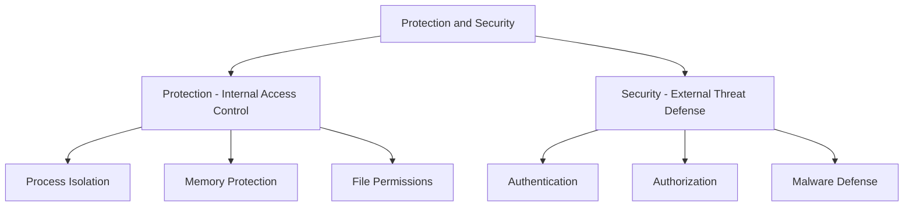

---

## 7. CPU / Resource Management

### What Are System Resources?

* Anything a process needs to execute: **CPU time, memory, storage space, and I/O devices**.

### CPU Resource

* The most fundamental and heavily contested resource — every running process needs CPU time to execute instructions.

### Memory Resource

* Main memory (RAM) needed by processes to hold their code and data during execution.

### Storage Resource

* Secondary storage space needed to persist files and program data.

### I/O Resources

* Devices such as printers, disks, and network interfaces, needed for input/output operations.

### Resource Allocation

* The OS assigns available resources to requesting processes based on scheduling policies and availability.

### Resource Deallocation

* When a process no longer needs a resource (or terminates), the OS **reclaims** it for reuse by other processes.

### Resource Sharing

* Multiple processes may need to use the **same resource** (e.g., a shared file or a printer) — the OS coordinates this sharing safely.

### Resource Scheduling

* Determines the **order and duration** for which processes get access to contested resources.

### Handling Competing Resource Requests

* When multiple processes request the same resource simultaneously, the OS uses scheduling and allocation policies to resolve conflicts fairly and efficiently, while trying to avoid problems like starvation or deadlock.

### Central Resource Management Diagram

```text
                    Operating System
                           │
          ┌────────────────┼────────────────┐
          ↓                ↓                ↓
         CPU             Memory          I/O Devices
          │                │                │
          └────────────────┼────────────────┘
                           ↓
                    Resource Management
```

---

## 8. Networking / Communication Management

### Why OS Needs Networking

* Modern computers rarely work in isolation — they connect to other systems to **share data, resources, and services**.
* The OS provides the foundation that allows this communication to happen reliably and securely.

### Network Communication

* The OS manages the sending and receiving of data between computers, using **network protocols** to ensure data is transmitted correctly.

### Communication Between Computers

* Enabled through the OS's networking stack, which handles addressing, data packaging, and transmission over network hardware (like a network interface card).

### Network Resources

* Includes shared drives, printers, and services accessible over a network — the OS manages access to these just like local resources.

### Network Interfaces

* Hardware/software components (e.g., a network card and its driver) that the OS uses to send and receive data over a network.

### Resource Sharing Over Networks

* Allows multiple computers to **share files, storage, and devices** (like a shared network printer) without needing physical duplication.

### Client-Server Concept

> In this model, a **server** provides a service or resource, and one or more **clients** request and use that service over a network.


### Distributed Communication — Introduction

* In a **distributed system**, multiple independent computers work together and communicate over a network to appear as a single coherent system to the user.
* *(This is explored in depth under Distributed Systems in OS Classification.)*

⋆.˚ *The goal here is simply to understand the OS's role in enabling networking — not to study networking protocols themselves.*

---

## 9. User Interface Management

### What is a User Interface?

> A **User Interface (UI)** is the means by which a user interacts with the computer system — issuing commands and receiving output.

### CLI (Command Line Interface)

* Users type text-based commands to interact with the OS.
* Fast, powerful for scripting/automation, but requires learning command syntax.

### GUI (Graphical User Interface)

* Users interact through visual elements — windows, icons, menus, and pointers.
* Intuitive and beginner-friendly.

### Shell

> The **shell** is a program that provides the interface (often command-line) through which users interact with the OS's services — it interprets user commands and passes them to the kernel.

### Command Interpreter

* Another term closely related to the shell — it **reads, interprets, and executes** commands typed by the user.

### User Commands

* Instructions typed or selected by the user to perform an action (e.g., `mkdir`, `copy`, or clicking "New Folder").

### Interaction Between User and OS

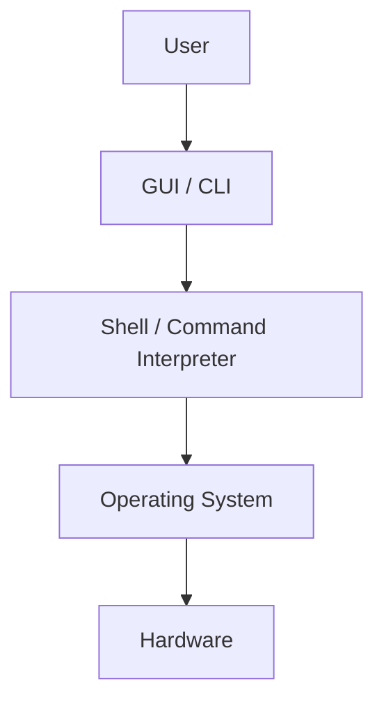

### System Calls as a Bridge Between Applications and OS

* Just as the shell bridges the **user** to the OS, **system calls** bridge **applications/programs** to the OS.
* Both ultimately allow requests to reach the kernel, which performs the actual privileged operation.

---

## 10. Error Detection and Handling

### Why Errors Occur

* Computer systems are complex, involving hardware, software, and their interactions — failures can occur at any layer.

### Hardware Errors

* Examples: Disk read failure, memory corruption, device malfunction.

### Software Errors

* Examples: Bugs in application code, invalid operations, logic errors.

### Memory Errors

* Examples: A process trying to access memory outside its allocated space (illegal memory access).

### I/O Errors

* Examples: A printer running out of paper, a disk failing to respond.

### File-System Errors

* Examples: A corrupted file, an attempt to open a non-existent file.

### CPU/Process Errors

* Examples: A process attempting an illegal instruction, or dividing by zero.

### Detecting Errors

* The OS uses hardware signals (like traps and interrupts) and internal checks to **notice when something has gone wrong**.

### Reporting Errors

* The OS informs the affected program (or the user) about the nature of the error, often via error codes or messages.

### Recovering from Errors

* Depending on severity, the OS may:
  * Retry the operation.
  * Terminate only the affected process.
  * Alert the user.
  * In severe cases, safely shut down to prevent further damage.

### Maintaining System Reliability

* By isolating and handling errors gracefully, the OS ensures that **one faulty component doesn't bring down the entire system**.

### Error Handling Flow

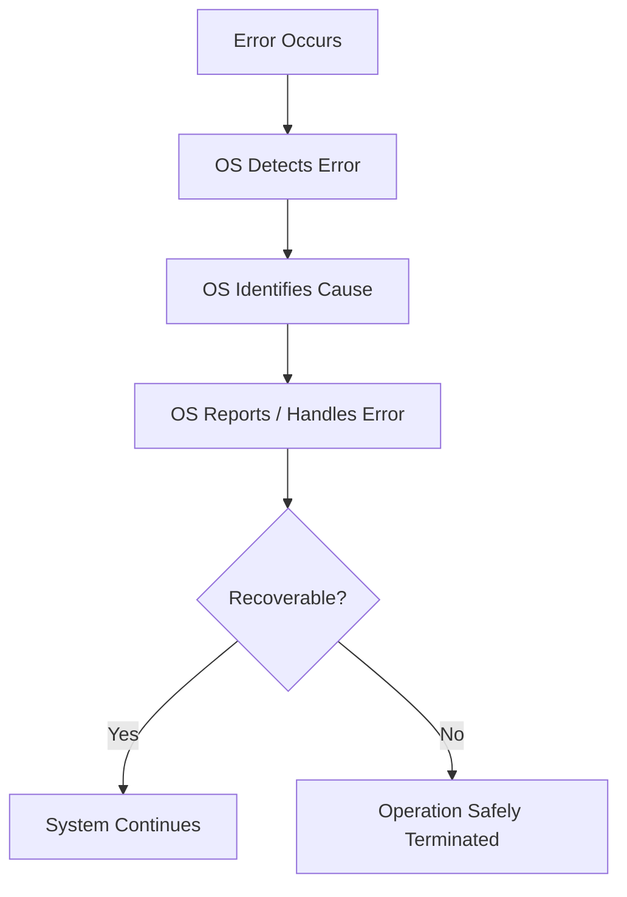

---

## 11. Accounting and Resource Monitoring

### Tracking Resource Usage

* The OS keeps records of **how much of each resource** is being used, by which processes and users.

### CPU Usage

* Tracks how much processing time each process/user consumes — useful for performance analysis and, in multi-user/billed systems, for accounting.

### Memory Usage

* Tracks how much RAM each process is consuming at any given time.

### Storage Usage

* Tracks how much secondary storage space is used/available, often per user or per process.

### User Activity

* Logs actions taken by users on the system, useful for auditing and troubleshooting.

### Performance Monitoring

* The OS (often with monitoring tools/utilities) tracks system performance metrics to identify bottlenecks or unusual behavior.

### Resource Utilization

* Overall statistics showing how effectively the system's resources are being used — helps in optimizing system performance and planning capacity.

⋆.˚ *Think of this function as the OS's "record-keeping department" — it doesn't just manage resources, it also keeps track of how they're being used.*

---

## 12. Program Execution

### Concept

Program execution ties together **almost every OS function** covered above — it's the complete journey of taking a stored program and turning it into a running process producing results.

### Steps Involved

1. **Loading Programs** — The OS locates the program on secondary storage and prepares it for execution.
2. **Allocating Memory** — Memory management assigns RAM space for the program's code, data, and stack.
3. **Creating Processes** — The OS creates a process (with a PCB) to represent the executing program.
4. **Scheduling CPU** — The process scheduler determines when this process gets CPU time.
5. **Executing Instructions** — The CPU fetches and executes the process's instructions.
6. **Handling I/O** — If the program needs input/output, the OS manages this via device drivers and interrupts.
7. **Terminating Programs** — Once execution completes (or is stopped), the OS ends the process.
8. **Returning Resources** — All memory, CPU allocation, and other resources used by the process are reclaimed for future use.

### Complete Program Execution Flowchart

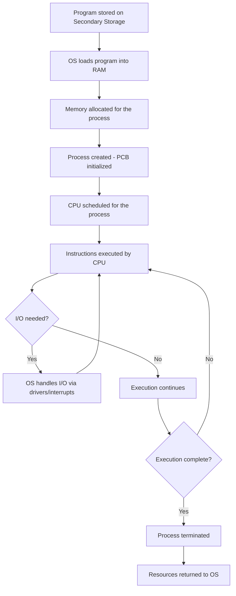

⋆˚꩜｡ *Notice how this single flow uses Process Management, Memory Management, I/O Management, and Resource Management all at once — this is why Program Execution is considered a core, unifying OS function.*

---

## 13. Exam Preparation

### Important Definitions

* Process
* Process Control Block (PCB)
* Context Switching
* Virtual Memory
* Paging / Segmentation
* Spooling
* Buffering
* Protection
* Security
* Client-Server Model
* Shell

### Important Concepts

* The difference between a program and a process, and why this distinction matters.
* The complete process life cycle and state transitions.
* How logical addresses are translated to physical addresses via the MMU.
* The purpose and difference between buffering, caching, and spooling.
* Why Protection and Security are separate concerns, not the same thing.
* How Program Execution integrates process, memory, and I/O management into one flow.

### Common Confusions

* **Program vs Process** — a program is passive (stored code); a process is active (executing).
* **Buffering vs Caching** — buffering handles speed mismatches; caching speeds up repeated access to the same data.
* **Protection vs Security** — protection is internal access control; security defends against external threats.
* **Paging vs Segmentation** — paging uses fixed-size blocks; segmentation uses variable-size logical divisions.
* **Deadlock vs normal waiting** — deadlock is a permanent, circular waiting condition; normal waiting resolves once the awaited event occurs.

### Exam-Oriented Questions

**Very Short Questions**
* Define a process.
* What is context switching?
* What is spooling?
* Differentiate between Protection and Security in one line.

**Short-Answer Questions**
* Explain the process state transition diagram.
* Differentiate between logical and physical addresses.
* What is the role of a device driver?
* Explain the client-server communication model.

**Long-Answer Questions**
* Explain Process Management in detail, covering process states, scheduling, and context switching.
* Describe the complete flow of Program Execution, connecting it to memory, process, and I/O management.
* Discuss Protection and Security as OS functions, with clear distinctions and examples.
* Explain virtual memory, paging, and segmentation as introductory memory management concepts.

**Conceptual Questions**
* Why is context switching considered overhead, and why is it still necessary?
* Why can't applications directly manage devices without OS/driver involvement?
* How do buffering and spooling both help manage speed mismatches, and how do they differ in purpose?

---

## 14. Final Concept Map

```mermaid
flowchart TD
    OS[Functions of Operating System]

    OS --> PM[Process Management]
    PM --> PM1[States & Scheduling]
    PM --> PM2[Context Switching]
    PM --> PM3[IPC & Synchronization]

    OS --> MM[Memory Management]
    MM --> MM1[Logical vs Physical Address]
    MM --> MM2[Swapping & Virtual Memory]
    MM --> MM3[Paging & Segmentation]

    OS --> FM[File Management]
    FM --> FM1[Files & Directories]
    FM --> FM2[Permissions & Protection]

    OS --> IO[Device / IO Management]
    IO --> IO1[Drivers & Buffering]
    IO --> IO2[Spooling & Interrupts]

    OS --> SM[Secondary Storage Management]
    SM --> SM1[Allocation & Free Space]

    OS --> PS[Protection and Security]
    PS --> PS1[Protection - Internal]
    PS --> PS2[Security - External]

    OS --> RM[CPU / Resource Management]
    RM --> RM1[Allocation & Scheduling]

    OS --> NW[Networking Management]
    NW --> NW1[Client-Server Model]

    OS --> UI[User Interface Management]
    UI --> UI1[Shell & System Calls]

    OS --> EH[Error Detection and Handling]
    EH --> EH1[Detect to Report to Recover]

    OS --> AC[Accounting & Resource Monitoring]

    OS --> PE[Program Execution]
    PE --> PE1[Load to Schedule to Execute to Terminate]
```

𖹭 *This map connects all twelve functions — together they form the complete responsibility set of an Operating System. Use it as your master revision anchor for this topic.*

---

<div align="center">
⋆˚꩜｡
</div>

<div align="center">

</div>

If you enjoyed these notes, you'll probably enjoy the rest too.

| Platform | Link |
|---|---|
| Instagram | @mehrunnisa.ai |
| SubStack | The Epoch |
| YouTube | @mehrunnisa.ai |

**Usage Terms**

These notes are free to use for personal learning, revision, and study. Please do not:
- Sell or redistribute for profit.
- Claim them as your own work.
- Modify and republish without permission.
- Use for any unethical or unauthorized purpose.

Thank you for respecting the effort behind these notes. Happy learning. ♡

</div>
